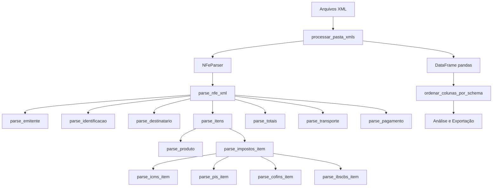

# Análise do Código NFe Parser - Leitura de XML

## 📋 Visão Geral

O código [`leito_nfe_xml_v7.py`](leito_nfe_xml_v7.py:1) é um parser completo para Nota Fiscal Eletrônica (NF-e) que extrai dados de arquivos XML seguindo o schema oficial da NF-e versão 4.00. O sistema processa XMLs de notas fiscais e converte os dados em formato estruturado (DataFrame do pandas) para análise.

## 🏗️ Arquitetura do Sistema

### Componentes Principais



## 🔍 Processo de Leitura do XML

### 1. Inicialização do Parser

**Classe:** [`NFeParser`](leito_nfe_xml_v7.py:375)

```python
def __init__(self):
    self.namespaces = {
        'nfe': 'http://www.portalfiscal.inf.br/nfe',
        'ds': 'http://www.w3.org/2000/09/xmldsig#'
    }
```

**Características:**
- Define namespaces XML para parsing correto
- Suporta documentos com e sem namespace

### 2. Métodos Auxiliares de Busca

#### [`find_element()`](leito_nfe_xml_v7.py:382-389)
- Busca elementos XML com ou sem namespace
- Retorna `None` se elemento não encontrado
- Tenta primeiro com namespace, depois sem

#### [`find_element_text()`](leito_nfe_xml_v7.py:391-394)
- Extrai texto de um elemento XML
- Retorna `None` se elemento não existir

#### [`find_all_elements()`](leito_nfe_xml_v7.py:396-403)
- Busca múltiplos elementos (ex: itens da nota)
- Retorna lista vazia se nenhum elemento encontrado

#### [`_to_float()`](leito_nfe_xml_v7.py:405-410)
- Converte strings para float de forma segura
- Trata exceções e valores nulos

### 3. Fluxo Principal de Parsing

**Função:** [`parse_nfe_xml()`](leito_nfe_xml_v7.py:1043-1089)

```python
def parse_nfe_xml(self, xml_content):
    # 1. Parse do XML
    root = ET.fromstring(xml_content)
    
    # 2. Localiza elemento raiz infNFe
    nfe = self.find_element(root, 'NFe')
    inf_nfe = self.find_element(nfe, 'infNFe')
    
    # 3. Extrai dados do cabeçalho
    header_data = {}
    header_data['Id'] = inf_nfe.get('Id')
    header_data['versao_nfe'] = inf_nfe.get('versao')
    
    # 4. Parse dos grupos principais (ordem do schema)
    self.parse_emitente(inf_nfe, header_data)
    self.parse_identificacao(inf_nfe, header_data)
    self.parse_destinatario(inf_nfe, header_data)
    self.parse_totais(inf_nfe, header_data)
    self.parse_transporte(inf_nfe, header_data)
    self.parse_pagamento(inf_nfe, header_data)
    
    # 5. Parse dos itens (cada item herda header_data)
    all_items_data = self.parse_itens(inf_nfe, header_data)
    
    return all_items_data
```

### 4. Estrutura de Dados Extraídos

#### Grupos Principais (seguindo schema NF-e):

1. **Emitente** ([`parse_emitente`](leito_nfe_xml_v7.py:416-457))
   - CNPJ/CPF
   - Nome e Nome Fantasia
   - Endereço completo
   - Inscrição Estadual
   - Regime Tributário (CRT)

2. **Identificação** ([`parse_identificacao`](leito_nfe_xml_v7.py:463-501))
   - Número da NF-e
   - Série
   - Data de emissão
   - Tipo de operação
   - Natureza da operação
   - Chave de acesso

3. **Destinatário** ([`parse_destinatario`](leito_nfe_xml_v7.py:507-548))
   - CNPJ/CPF
   - Nome
   - Endereço completo
   - Indicador de IE

4. **Itens** ([`parse_itens`](leito_nfe_xml_v7.py:811-843))
   - Produto ([`parse_produto`](leito_nfe_xml_v7.py:555-592))
     - Código do produto
     - Descrição
     - NCM
     - CFOP
     - Unidade comercial
     - Quantidade
     - Valor unitário e total
   
   - Impostos ([`parse_impostos_item`](leito_nfe_xml_v7.py:796-808))
     - ICMS ([`parse_icms_item`](leito_nfe_xml_v7.py:662-698))
     - PIS ([`parse_pis_item`](leito_nfe_xml_v7.py:701-722))
     - COFINS ([`parse_cofins_item`](leito_nfe_xml_v7.py:725-746))
     - IBS/CBS - Reforma Tributária ([`parse_ibscbs_item`](leito_nfe_xml_v7.py:749-793))
     - GTribRegular ([`parse_gtribregular`](leito_nfe_xml_v7.py:630-660))

5. **Totais** ([`parse_totais`](leito_nfe_xml_v7.py:849-859))
   - ICMS Total ([`parse_icms_tot`](leito_nfe_xml_v7.py:862-896))
   - IBS/CBS Total ([`parse_ibscbs_tot`](leito_nfe_xml_v7.py:899-920))
   - Valor total da NF-e

6. **Transporte** ([`parse_transporte`](leito_nfe_xml_v7.py:1006-1019))
   - Modalidade de frete
   - Dados do transportador

7. **Pagamento** ([`parse_pagamento`](leito_nfe_xml_v7.py:1025-1037))
   - Forma de pagamento
   - Valor pago

## 📊 Classes de Dados (Dataclasses)

O código define 24 dataclasses para estruturar os dados:

### Principais Classes:

1. **Emitente e Endereço**
   - [`EnderecoEmitente`](leito_nfe_xml_v7.py:15-27)
   - [`Emitente`](leito_nfe_xml_v7.py:29-41)

2. **Identificação**
   - [`IdentificacaoNFE`](leito_nfe_xml_v7.py:47-76)

3. **Destinatário**
   - [`EnderecoDestinatario`](leito_nfe_xml_v7.py:82-94)
   - [`Destinatario`](leito_nfe_xml_v7.py:96-108)

4. **Produtos e Impostos**
   - [`Produto`](leito_nfe_xml_v7.py:122-154)
   - [`ICMS00`](leito_nfe_xml_v7.py:176-187), [`ICMS20`](leito_nfe_xml_v7.py:189-203)
   - [`PISAliq`](leito_nfe_xml_v7.py:206-212)
   - [`COFINSAliq`](leito_nfe_xml_v7.py:215-221)
   - [`GTribRegular`](leito_nfe_xml_v7.py:224-234) - Reforma Tributária

5. **Reforma Tributária (Novos Impostos)**
   - [`CreditoPresumido`](leito_nfe_xml_v7.py:115-120)
   - [`PartilhaICMS`](leito_nfe_xml_v7.py:157-167)
   - [`DesoneracaoICMS`](leito_nfe_xml_v7.py:169-174)

6. **Totais**
   - [`ICMSTot`](leito_nfe_xml_v7.py:259-284)
   - [`IBSCBSTot`](leito_nfe_xml_v7.py:287-294)
   - [`TotalNFE`](leito_nfe_xml_v7.py:297-304)

## 🔄 Processamento em Lote

**Função:** [`processar_pasta_xmls()`](leito_nfe_xml_v7.py:1312-1352)

```python
def processar_pasta_xmls(caminho_pasta, extensao='.xml'):
    parser = NFeParser()
    todos_dados = []
    
    # 1. Busca todos os XMLs na pasta
    arquivos_xml = glob.glob(os.path.join(caminho_pasta, f'*{extensao}'))
    
    # 2. Processa cada arquivo
    for arquivo in arquivos_xml:
        with open(arquivo, 'r', encoding='utf-8') as file:
            xml_content = file.read()
        
        dados_nfe = parser.parse_nfe_xml(xml_content)
        todos_dados.extend(dados_nfe)
    
    # 3. Converte para DataFrame
    df = pd.DataFrame(todos_dados)
    
    # 4. Ordena colunas conforme schema
    df = ordenar_colunas_por_schema(df)
    
    return df
```

## 📈 Funcionalidades de Análise

### 1. Ordenação de Colunas ([`ordenar_colunas_por_schema`](leito_nfe_xml_v7.py:1095-1159))
- Organiza colunas seguindo a ordem do schema oficial da NF-e
- Agrupa campos por categoria (emitente, identificação, produto, impostos, etc.)

### 2. Análise Completa ([`analisar_dados_completos`](leito_nfe_xml_v7.py:1354-1404))
- Total de NF-es processadas
- Total de itens
- Valores monetários consolidados
- Análise de impostos IBS/CBS
- Análise de GTribRegular

### 3. Criação de Abas para Excel
- [`criar_aba_estatisticas`](leito_nfe_xml_v7.py:1161-1214) - Estatísticas gerais
- [`criar_aba_resumo`](leito_nfe_xml_v7.py:1216-1254) - Resumo por NF-e
- [`criar_aba_detalhes_icms`](leito_nfe_xml_v7.py:1256-1264) - Detalhes ICMS
- [`criar_aba_detalhes_ibscbs`](leito_nfe_xml_v7.py:1266-1290) - Detalhes IBS/CBS
- [`criar_aba_gtribregular`](leito_nfe_xml_v7.py:1292-1310) - Detalhes Reforma Tributária

## ✅ Pontos Fortes

1. **Conformidade com Schema Oficial**
   - Segue rigorosamente a estrutura do schema leiauteNFe_v4.00.xsd
   - Ordem de parsing respeita a hierarquia oficial

2. **Tratamento de Namespaces**
   - Suporta XMLs com e sem namespace
   - Busca flexível de elementos

3. **Tratamento de Erros**
   - Try-catch em pontos críticos
   - Conversões seguras de tipos
   - Retorna valores padrão quando dados não existem

4. **Suporte à Reforma Tributária**
   - Implementa novos campos IBS/CBS
   - Suporta GTribRegular
   - Crédito presumido e partilha de ICMS

5. **Estrutura Modular**
   - Métodos separados por grupo de dados
   - Fácil manutenção e extensão
   - Reutilização de código

6. **Processamento em Lote**
   - Processa múltiplos XMLs de uma vez
   - Consolidação automática em DataFrame
   - Exportação para Excel com múltiplas abas

## ⚠️ Pontos de Atenção

1. **Tratamento de Encoding**
   - Usa `encoding='utf-8'` fixo
   - Pode falhar com XMLs em outras codificações

2. **Memória**
   - Carrega todo o XML em memória
   - Pode ser problemático com arquivos muito grandes
   - Acumula todos os dados antes de criar DataFrame

3. **Validação de Dados**
   - Não valida estrutura do XML antes de processar
   - Não verifica se campos obrigatórios estão presentes
   - Conversões de tipo podem falhar silenciosamente

4. **Logging**
   - Usa `print()` ao invés de logging estruturado
   - Dificulta debug em produção

5. **Configuração**
   - Namespaces hardcoded
   - Sem arquivo de configuração externo

## 🎯 Casos de Uso

### Uso Básico:
```python
# Processar uma pasta de XMLs
df = processar_pasta_xmls('/caminho/para/xmls')

# Analisar dados
analisar_dados_completos(df)

# Exportar para Excel com múltiplas abas
# (código de exportação não mostrado no trecho analisado)
```

### Uso Avançado:
```python
# Parser individual
parser = NFeParser()

# Ler XML
with open('nota.xml', 'r', encoding='utf-8') as f:
    xml_content = f.read()

# Processar
dados = parser.parse_nfe_xml(xml_content)

# Converter para DataFrame
df = pd.DataFrame(dados)
```

## 📝 Recomendações

### Melhorias Sugeridas:

1. **Logging Estruturado**
   ```python
   import logging
   logger = logging.getLogger(__name__)
   logger.info(f"Processando {arquivo}")
   ```

2. **Validação de Schema**
   ```python
   import xmlschema
   schema = xmlschema.XMLSchema('leiauteNFe_v4.00.xsd')
   schema.validate(xml_content)
   ```

3. **Configuração Externa**
   ```python
   # config.yaml
   namespaces:
     nfe: 'http://www.portalfiscal.inf.br/nfe'
   encoding: 'utf-8'
   ```

4. **Processamento Streaming**
   - Para XMLs muito grandes, usar `iterparse()`
   - Processar elementos incrementalmente

5. **Testes Unitários**
   - Criar testes para cada método de parsing
   - Validar edge cases

6. **Documentação**
   - Adicionar docstrings detalhadas
   - Exemplos de uso
   - Referências ao schema oficial

## 📚 Dependências

```python
import xml.etree.ElementTree as ET  # Parsing XML
import pandas as pd                  # Manipulação de dados
import numpy as np                   # Operações numéricas
from dataclasses import dataclass    # Estruturas de dados
from decimal import Decimal          # Precisão decimal
from typing import Dict, List, Optional, Any  # Type hints
import glob                          # Busca de arquivos
import os                            # Operações de sistema
from datetime import datetime        # Manipulação de datas
```

## 🔗 Referências

- Schema oficial: leiauteNFe_v4.00.xsd
- Portal da NF-e: http://www.nfe.fazenda.gov.br/
- Documentação XML: https://docs.python.org/3/library/xml.etree.elementtree.html
- Pandas: https://pandas.pydata.org/

## 📊 Estatísticas do Código

- **Total de linhas:** 1481
- **Classes de dados:** 24
- **Métodos de parsing:** 15+
- **Grupos de dados suportados:** 7 principais
- **Impostos suportados:** ICMS, PIS, COFINS, IBS, CBS
- **Versão do schema:** 4.00