# Plano de Melhorias - NFe Parser com GUI

## 🎯 Objetivos

1. **GUI Dupla**: Interface desktop (tkinter) e web (Streamlit)
2. **Logging Estruturado**: Sistema robusto de logs com níveis e rotação
3. **Processamento Streaming**: Suporte para arquivos XML grandes
4. **Mapeamento Dinâmico**: Sistema facilitado para adicionar novos campos XML

## 🏗️ Arquitetura Proposta

```mermaid
graph TB
    subgraph "Interface Layer"
        A[GUI Tkinter Desktop]
        B[GUI Streamlit Web]
    end
    
    subgraph "Business Logic Layer"
        C[Parser Controller]
        D[Field Mapper]
        E[Config Manager]
    end
    
    subgraph "Data Processing Layer"
        F[Streaming Parser]
        G[Batch Processor]
        H[Data Validator]
    end
    
    subgraph "Infrastructure Layer"
        I[Logger System]
        J[File Handler]
        K[Export Manager]
    end
    
    subgraph "Storage"
        L[XML Files]
        M[Config YAML]
        N[Output Files]
        O[Log Files]
    end
    
    A --> C
    B --> C
    C --> D
    C --> E
    C --> F
    C --> G
    D --> M
    E --> M
    F --> H
    G --> H
    H --> K
    C --> I
    F --> I
    G --> I
    J --> L
    K --> N
    I --> O
```



## 📋 Estrutura de Arquivos Proposta

```
nfe_parser/
├── src/
│   ├── core/
│   │   ├── __init__.py
│   │   ├── parser.py              # Parser principal refatorado
│   │   ├── streaming_parser.py    # Parser com streaming
│   │   ├── field_mapper.py        # Mapeamento dinâmico de campos
│   │   └── validator.py           # Validação de dados
│   │
│   ├── config/
│   │   ├── __init__.py
│   │   ├── settings.py            # Configurações gerais
│   │   ├── field_mapping.yaml     # Mapeamento de campos XML
│   │   └── logging_config.yaml    # Configuração de logs
│   │
│   ├── gui/
│   │   ├── __init__.py
│   │   ├── tkinter_app.py         # Interface desktop
│   │   └── streamlit_app.py       # Interface web
│   │
│   ├── utils/
│   │   ├── __init__.py
│   │   ├── logger.py              # Sistema de logging
│   │   ├── file_handler.py        # Manipulação de arquivos
│   │   └── export_manager.py      # Exportação de resultados
│   │
│   └── models/
│       ├── __init__.py
│       └── dataclasses.py         # Todas as dataclasses
│
├── tests/
│   ├── test_parser.py
│   ├── test_streaming.py
│   └── test_field_mapper.py
│
├── docs/
│   ├── user_guide.md
│   ├── developer_guide.md
│   └── field_mapping_guide.md
│
├── config/
│   ├── field_mapping.yaml
│   └── settings.yaml
│
├── logs/
│   └── .gitkeep
│
├── requirements.txt
├── requirements-dev.txt
├── setup.py
└── README.md
```

## 🔧 Componentes Detalhados

### 1. Sistema de Logging Estruturado

**Arquivo:** `src/utils/logger.py`

**Características:**
- Múltiplos níveis (DEBUG, INFO, WARNING, ERROR, CRITICAL)
- Rotação automática de logs
- Formatação estruturada (JSON opcional)
- Logs separados por módulo
- Console e arquivo simultâneos

**Configuração:** `src/config/logging_config.yaml`
```yaml
version: 1
formatters:
  standard:
    format: '%(asctime)s - %(name)s - %(levelname)s - %(message)s'
  detailed:
    format: '%(asctime)s - %(name)s - %(levelname)s - %(funcName)s:%(lineno)d - %(message)s'

handlers:
  console:
    class: logging.StreamHandler
    level: INFO
    formatter: standard
    stream: ext://sys.stdout
  
  file:
    class: logging.handlers.RotatingFileHandler
    level: DEBUG
    formatter: detailed
    filename: logs/nfe_parser.log
    maxBytes: 10485760  # 10MB
    backupCount: 5

loggers:
  nfe_parser:
    level: DEBUG
    handlers: [console, file]
    propagate: no

root:
  level: INFO
  handlers: [console]
```

### 2. Processamento Streaming

**Arquivo:** `src/core/streaming_parser.py`

**Características:**
- Usa `xml.etree.ElementTree.iterparse()`
- Processa elementos incrementalmente
- Libera memória após processar cada elemento
- Suporta arquivos de qualquer tamanho
- Callback para progresso em tempo real

**Exemplo de Implementação:**
```python
class StreamingNFeParser:
    def parse_xml_stream(self, file_path, callback=None):
        """Parse XML usando streaming para economizar memória"""
        context = ET.iterparse(file_path, events=('start', 'end'))
        context = iter(context)
        
        items_data = []
        current_item = {}
        
        for event, elem in context:
            if event == 'end':
                if elem.tag.endswith('det'):
                    # Processar item completo
                    item_data = self._process_item(elem)
                    items_data.append(item_data)
                    
                    # Liberar memória
                    elem.clear()
                    
                    # Callback de progresso
                    if callback:
                        callback(len(items_data))
        
        return items_data
```

### 3. Mapeamento Dinâmico de Campos

**Arquivo:** `src/config/field_mapping.yaml`

**Estrutura:**
```yaml
# Mapeamento de campos XML para DataFrame
# Formato: campo_destino: caminho_xml

emitente:
  emit_CNPJ:
    xpath: "emit/CNPJ"
    type: string
    required: false
  
  emit_xNome:
    xpath: "emit/xNome"
    type: string
    required: true
  
  emit_ender_xLgr:
    xpath: "emit/enderEmit/xLgr"
    type: string
    required: false

identificacao:
  nNF:
    xpath: "ide/nNF"
    type: integer
    required: true
  
  dhEmi:
    xpath: "ide/dhEmi"
    type: datetime
    required: true
    format: "%Y-%m-%dT%H:%M:%S%z"

produto:
  cProd:
    xpath: "det/prod/cProd"
    type: string
    required: true
  
  xProd:
    xpath: "det/prod/xProd"
    type: string
    required: true
  
  vProd:
    xpath: "det/prod/vProd"
    type: decimal
    required: true

impostos:
  icms_CST:
    xpath: "det/imposto/ICMS/*/CST"
    type: string
    required: false
  
  icms_vBC:
    xpath: "det/imposto/ICMS/*/vBC"
    type: decimal
    required: false

# Campos customizados - fácil adicionar novos
custom_fields:
  meu_campo_novo:
    xpath: "det/prod/meuCampo"
    type: string
    required: false
    default: "N/A"
```

**Arquivo:** `src/core/field_mapper.py`

```python
class FieldMapper:
    def __init__(self, config_path='config/field_mapping.yaml'):
        self.mapping = self._load_mapping(config_path)
    
    def add_field(self, field_name, xpath, field_type='string', required=False):
        """Adiciona novo campo dinamicamente"""
        self.mapping[field_name] = {
            'xpath': xpath,
            'type': field_type,
            'required': required
        }
    
    def get_field_value(self, element, field_name):
        """Extrai valor do campo usando mapeamento"""
        config = self.mapping.get(field_name)
        if not config:
            return None
        
        value = self._extract_by_xpath(element, config['xpath'])
        return self._convert_type(value, config['type'])
```

### 4. GUI Desktop (Tkinter)

**Arquivo:** `src/gui/tkinter_app.py`

**Funcionalidades:**
- Seleção de arquivos/pastas
- Configuração de opções de parsing
- Barra de progresso em tempo real
- Visualização de logs
- Preview dos dados
- Exportação para múltiplos formatos
- Gerenciamento de mapeamento de campos

**Layout:**
```
┌─────────────────────────────────────────────────────┐
│  NFe Parser - Desktop                        [_][□][X]│
├─────────────────────────────────────────────────────┤
│  Arquivo  Editar  Configurações  Ajuda              │
├─────────────────────────────────────────────────────┤
│                                                       │
│  📁 Selecionar Arquivos: [Escolher...]  [Pasta...]  │
│                                                       │
│  ⚙️ Opções:                                          │
│  ☑ Processamento Streaming                          │
│  ☑ Validar Schema                                   │
│  ☑ Incluir campos customizados                      │
│                                                       │
│  📊 Progresso:                                       │
│  ████████████████░░░░░░░░░░  65% (13/20 arquivos)   │
│                                                       │
│  📝 Logs:                                            │
│  ┌───────────────────────────────────────────────┐  │
│  │ [INFO] Processando arquivo 13/20...          │  │
│  │ [INFO] 145 itens extraídos                   │  │
│  │ [WARNING] Campo opcional não encontrado      │  │
│  │ [INFO] Arquivo processado com sucesso        │  │
│  └───────────────────────────────────────────────┘  │
│                                                       │
│  [Iniciar Processamento]  [Parar]  [Exportar]       │
│                                                       │
└─────────────────────────────────────────────────────┘
```

### 5. GUI Web (Streamlit)

**Arquivo:** `src/gui/streamlit_app.py`

**Funcionalidades:**
- Upload de múltiplos arquivos
- Processamento em tempo real
- Visualização interativa de dados
- Gráficos e estatísticas
- Download de resultados
- Editor de mapeamento de campos

**Estrutura:**
```python
import streamlit as st

def main():
    st.set_page_config(page_title="NFe Parser", layout="wide")
    
    st.title("🧾 NFe Parser - Análise de Notas Fiscais")
    
    # Sidebar
    with st.sidebar:
        st.header("⚙️ Configurações")
        use_streaming = st.checkbox("Processamento Streaming", value=True)
        validate_schema = st.checkbox("Validar Schema", value=False)
        
        st.header("📁 Upload")
        uploaded_files = st.file_uploader(
            "Selecione arquivos XML",
            type=['xml'],
            accept_multiple_files=True
        )
    
    # Main area
    if uploaded_files:
        col1, col2 = st.columns([2, 1])
        
        with col1:
            st.header("📊 Dados Processados")
            # Processar e exibir dados
        
        with col2:
            st.header("📈 Estatísticas")
            # Exibir métricas
```

## 📝 Implementação Passo a Passo

### Fase 1: Infraestrutura Base (Semana 1)

1. **Criar estrutura de diretórios**
   - Organizar arquivos conforme estrutura proposta
   - Configurar `setup.py` e `requirements.txt`

2. **Implementar sistema de logging**
   - Criar `src/utils/logger.py`
   - Configurar `src/config/logging_config.yaml`
   - Integrar logs em todo o código

3. **Criar sistema de configuração**
   - Implementar `src/config/settings.py`
   - Criar arquivo `config/settings.yaml`

### Fase 2: Parser Refatorado (Semana 2)

4. **Refatorar parser existente**
   - Mover para `src/core/parser.py`
   - Separar responsabilidades
   - Adicionar type hints completos
   - Melhorar tratamento de erros

5. **Implementar streaming parser**
   - Criar `src/core/streaming_parser.py`
   - Implementar `iterparse()` com callbacks
   - Testar com arquivos grandes (>100MB)

6. **Criar sistema de mapeamento dinâmico**
   - Implementar `src/core/field_mapper.py`
   - Criar `config/field_mapping.yaml`
   - Documentar como adicionar campos

### Fase 3: GUI Desktop (Semana 3)

7. **Desenvolver interface tkinter**
   - Layout principal
   - Seleção de arquivos
   - Barra de progresso
   - Visualização de logs

8. **Integrar parser com GUI**
   - Threading para não bloquear interface
   - Callbacks de progresso
   - Tratamento de erros visual

### Fase 4: GUI Web (Semana 4)

9. **Desenvolver interface Streamlit**
   - Upload de arquivos
   - Processamento assíncrono
   - Visualizações interativas
   - Download de resultados

10. **Adicionar funcionalidades avançadas**
    - Gráficos e dashboards
    - Filtros e buscas
    - Comparação de NF-es

### Fase 5: Testes e Documentação (Semana 5)

11. **Criar testes unitários**
    - Testes para parser
    - Testes para streaming
    - Testes para field mapper

12. **Documentação completa**
    - Guia do usuário
    - Guia do desenvolvedor
    - Como adicionar campos
    - API reference

## 🎨 Exemplos de Uso

### Adicionar Novo Campo (Super Fácil!)

**Opção 1: Via arquivo YAML**
```yaml
# config/field_mapping.yaml
custom_fields:
  meu_novo_campo:
    xpath: "det/prod/meuCampo"
    type: string
    required: false
    default: "N/A"
```

**Opção 2: Via código**
```python
from src.core.field_mapper import FieldMapper

mapper = FieldMapper()
mapper.add_field(
    field_name='meu_novo_campo',
    xpath='det/prod/meuCampo',
    field_type='string',
    required=False
)
```

**Opção 3: Via GUI**
- Abrir menu "Configurações" → "Gerenciar Campos"
- Clicar em "Adicionar Campo"
- Preencher formulário
- Salvar

### Usar Processamento Streaming

```python
from src.core.streaming_parser import StreamingNFeParser

parser = StreamingNFeParser()

def progress_callback(items_processed):
    print(f"Processados: {items_processed} itens")

# Processar arquivo grande
data = parser.parse_xml_stream(
    'nota_grande.xml',
    callback=progress_callback
)
```

### Executar GUI Desktop

```bash
python src/gui/tkinter_app.py
```

### Executar GUI Web

```bash
streamlit run src/gui/streamlit_app.py
```

## 📦 Dependências

```txt
# requirements.txt
pandas>=2.0.0
numpy>=1.24.0
openpyxl>=3.1.0
pyyaml>=6.0
python-dateutil>=2.8.0

# GUI
streamlit>=1.28.0
plotly>=5.17.0

# Logging
colorlog>=6.7.0

# Validação
xmlschema>=2.5.0

# Desenvolvimento
pytest>=7.4.0
black>=23.0.0
flake8>=6.1.0
mypy>=1.5.0
```

## ✅ Critérios de Sucesso

1. **Performance**
   - Processar 1000 XMLs em < 5 minutos
   - Suportar arquivos XML > 100MB
   - Uso de memória < 500MB para arquivos grandes

2. **Usabilidade**
   - Adicionar novo campo em < 2 minutos
   - Interface intuitiva (sem manual)
   - Feedback visual em tempo real

3. **Confiabilidade**
   - 100% dos campos obrigatórios extraídos
   - Logs detalhados de todos os erros
   - Recuperação automática de falhas

4. **Manutenibilidade**
   - Código com 80%+ de cobertura de testes
   - Documentação completa
   - Arquitetura modular

## 🚀 Próximos Passos

1. Revisar e aprovar este plano
2. Configurar ambiente de desenvolvimento
3. Iniciar Fase 1 (Infraestrutura Base)
4. Iterações semanais com feedback
5. Deploy e treinamento de usuários

## 📚 Referências

- [Python Logging](https://docs.python.org/3/library/logging.html)
- [XML iterparse](https://docs.python.org/3/library/xml.etree.elementtree.html#xml.etree.ElementTree.iterparse)
- [Tkinter Documentation](https://docs.python.org/3/library/tkinter.html)
- [Streamlit Documentation](https://docs.streamlit.io/)
- [Schema NF-e 4.00](http://www.nfe.fazenda.gov.br/portal/listaConteudo.aspx?tipoConteudo=BMPFMBoln3w=)